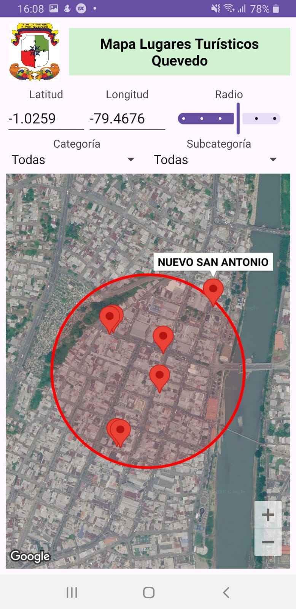
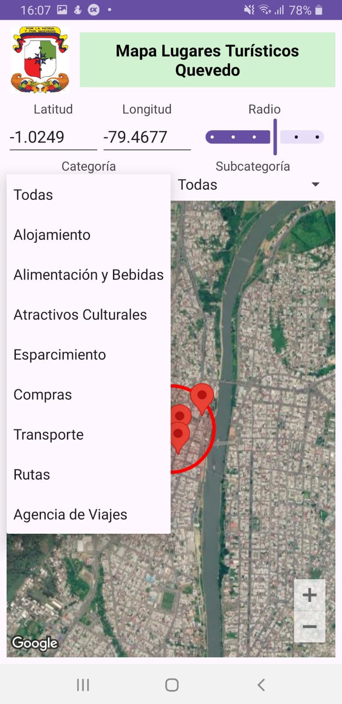
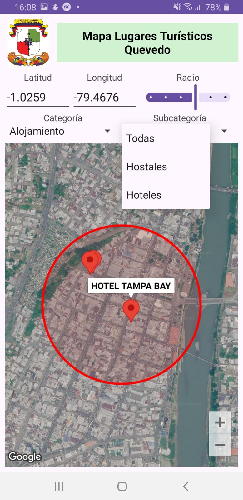

# App8 — Mapa de Lugares Turísticos de Quevedo con Filtros por Categoría


-----

|Campo      |Detalle                                              |
|-----------|-----------------------------------------------------|
|Universidad|Universidad Técnica Estatal de Quevedo (UTEQ)        |
|Facultad   |Facultad de Ciencias de la Computación (FCC)         |
|Carrera    |Software                                             |
|Materia    |Aplicaciones Móviles — SOFT-R-A · 6to Nivel · Corte 2|
|Tema       |Consumo de servicios REST con Volley sobre Google Maps SDK|
|Estudiante |Eduardo Reinoso Vélez                                |

-----

## Objetivo

Consumir el backend REST de turismo de Quevedo mediante **Volley** como cliente HTTP y representar los lugares turísticos devueltos como marcadores sobre un `SupportMapFragment` en vista satelital. La aplicación permite delimitar la zona de búsqueda con un círculo de radio ajustable centrado en la posición de la cámara, y refinar los marcadores visibles mediante dos `Spinner` encadenados (Categoría → Subcategoría) cuyo filtrado se aplica del lado del cliente sobre el listado de lugares ya descargado.

-----

## Tecnologías

|Tecnología / Herramienta|Versión|Propósito                                                 |
|------------------------|-------|----------------------------------------------------------|
|Java                    |11     |Lenguaje principal                                        |
|Android SDK             |API 29–36|Plataforma de ejecución                                 |
|Google Maps SDK         |18.2.0 |Renderizado del mapa, marcadores y círculo de radio       |
|Play Services Location  |21.3.0 |Permisos y servicios de ubicación                         |
|Volley                  |1.2.1  |Cliente HTTP para consumir el backend REST de turismo     |
|Activity KTX            |1.13.0 |Soporte de ciclo de vida de la actividad                  |
|ConstraintLayout        |2.2.1  |Dependencia de layout incluida en el catálogo de versiones|
|Material Components     |1.14.0 |`Slider` para el radio de búsqueda                        |
|Gradle (Kotlin DSL)     |9.2.1  |Sistema de construcción con catálogo de versiones (TOML)  |
|Android Studio          |Panda 4.x|IDE de desarrollo                                       |

-----

## Arquitectura

`MainActivity` implementa `OnMapReadyCallback` y delega el acceso a red en `TurismoApiService`, que reutiliza una única `RequestQueue` de Volley expuesta por el singleton `ApiClient`. Las respuestas JSON se mapean a los modelos `Categoria`, `Subcategoria` y `LugarTuristico`, y se devuelven a la actividad mediante la interfaz genérica `ApiCallback<T>`.

```
MainActivity (AppCompatActivity + OnMapReadyCallback)
├── onCreate()
│   ├── setContentView(activity_main.xml)
│   ├── new TurismoApiService(this)          ← RequestQueue de Volley (ApiClient)
│   ├── configurarSpinners()                  ← adapters de Categoría y Subcategoría
│   ├── cargarCategorias()                    ← GET /categoria/getlistadoCB
│   └── SupportMapFragment.getMapAsync()
└── onMapReady(GoogleMap)
    ├── MAP_TYPE_SATELLITE + zoomControlsEnabled
    ├── moveCamera(LatLng inicial, zoom 15)
    ├── OnCameraIdleListener                  ← recentra lat/lng y llama updateInterfaz()
    ├── OnMarkerClickListener                 ← marker.showInfoWindow()
    └── updateInterfaz()
        ├── CircleOptions(radio * 100 m, borde rojo, relleno translúcido)
        └── apiService.getLugares(lat, lng, radio)
            └── onSuccess → lugaresCompletos → aplicarFiltro()
                └── filtra por Categoria.getId() y Subcategoria.getId() seleccionados

api/
├── ApiClient          ← singleton con RequestQueue (Volley.newRequestQueue)
├── ApiCallback<T>     ← onSuccess(T) / onError(String)
└── TurismoApiService  ← JsonArrayRequest (categorías/subcategorías) y JsonObjectRequest (lugares)

model/
├── Categoria       ← id, descripcion (+ Categoria.todas())
├── Subcategoria    ← id, categoriaId, descripcion (+ Subcategoria.todas())
└── LugarTuristico  ← id, nombre, lat, lng, categoriaId, subcategoriaId
```

-----

## Estructura del proyecto

```
App8/
├── app/
│   ├── src/
│   │   └── main/
│   │       ├── java/com/uteq/software/app8/
│   │       │   ├── MainActivity.java
│   │       │   ├── api/
│   │       │   │   ├── ApiClient.java
│   │       │   │   ├── ApiCallback.java
│   │       │   │   └── TurismoApiService.java
│   │       │   └── model/
│   │       │       ├── Categoria.java
│   │       │       ├── Subcategoria.java
│   │       │       └── LugarTuristico.java
│   │       ├── res/
│   │       │   ├── layout/
│   │       │   │   └── activity_main.xml     # LinearLayout + Spinners + Slider + SupportMapFragment
│   │       │   └── values/
│   │       │       └── strings.xml
│   │       └── AndroidManifest.xml           # API key, permisos de ubicación e INTERNET, cleartext habilitado
│   └── build.gradle.kts
├── gradle/
│   └── libs.versions.toml                    # Catálogo central de versiones
├── build.gradle.kts
└── settings.gradle.kts
```

-----

## Funcionalidades implementadas

Al iniciar, la aplicación centra el mapa en modo satelital sobre las coordenadas `-1.02313, -79.459561` con zoom 15 y dibuja un círculo rojo cuyo radio depende del `Slider` (rango 0–5, paso 1, escalado a metros como `radio * 100`). Los campos de texto de latitud y longitud se actualizan automáticamente cuando la cámara del mapa queda quieta (`OnCameraIdleListener`), tomando como referencia el nuevo centro visible. Cada vez que cambian la posición o el radio, `TurismoApiService.getLugares()` consulta el endpoint `lugar_turistico/json_getlistadoMapa` enviando `lat`, `lng` y `radio` (dividido entre 10) como parámetros, y almacena el resultado completo en memoria. Al arrancar también se cargan las categorías desde `categoria/getlistadoCB`, agregando una opción "Todas" al inicio del `Spinner` de Categoría; al seleccionar una categoría distinta de "Todas" se consulta `subcategoria/getlistadoCB/{id}` para poblar el segundo `Spinner`, encadenado al primero, mientras que elegir "Todas" restablece la Subcategoría a su única opción "Todas". El filtrado de los marcadores mostrados en el mapa ocurre íntegramente en el cliente: `aplicarFiltro()` recorre la lista de lugares ya descargada y solo agrega un `Marker` por cada lugar cuya `categoriaId`/`subcategoriaId` coincida con la selección vigente en los spinners, eliminando y recreando los marcadores existentes en cada pasada. Al tocar un marcador se muestra su ventana de información con el nombre del lugar turístico.

-----

## Instalación y ejecución

**Requisitos previos:** Android Studio Panda 4, JDK 11, dispositivo o emulador con API 29+ y Google Play Services, cuenta en [Google Cloud Console](https://console.cloud.google.com/) con la API *Maps SDK for Android* habilitada, y acceso de red al backend REST (`http://35.153.103.86/turismo10022025`).

1. Clonar el repositorio:

   ```bash
   git clone https://github.com/ereinosov/App8.git
   ```

1. Abrir la carpeta `App8/` en Android Studio.

1. En `app/src/main/AndroidManifest.xml`, reemplazar el valor vacío del meta-dato `com.google.android.geo.API_KEY` con la clave obtenida de Google Cloud Console:

   ```xml
   <meta-data
       android:name="com.google.android.geo.API_KEY"
       android:value="TU_API_KEY_AQUI" />
   ```

1. Sincronizar Gradle desde **File → Sync Project with Gradle Files**.

1. Ejecutar con **Run → Run 'app'** (`Shift + F10`) sobre un dispositivo o emulador con conexión a internet, necesaria tanto para el mapa como para las peticiones Volley al backend.

> La API key no debe subirse al repositorio. Se recomienda añadir el valor a `local.properties` e inyectarlo en tiempo de compilación mediante el [Secrets Gradle Plugin for Android](https://github.com/google/secrets-gradle-plugin). El backend se consume por HTTP plano (`usesCleartextTraffic="true"`), por lo que solo debe usarse en entornos de práctica, no en producción.

-----

## Dependencias principales

```kotlin
// app/build.gradle.kts — vía catálogo de versiones (libs.versions.toml)
dependencies {
    implementation(libs.play.services.maps)      // com.google.android.gms:play-services-maps:18.2.0
    implementation(libs.play.services.location)  // com.google.android.gms:play-services-location:21.3.0
    implementation(libs.volley)                  // com.android.volley:volley:1.2.1
    implementation(libs.activity.ktx)             // androidx.activity:activity-ktx:1.13.0
    implementation(libs.appcompat)                // androidx.appcompat:appcompat:1.7.1
    implementation(libs.constraintlayout)         // androidx.constraintlayout:constraintlayout:2.2.1
    implementation(libs.material)                 // com.google.android.material:material:1.14.0
}
```

-----

## Capturas de pantalla







-----

*Universidad Técnica Estatal de Quevedo · FCC · Carrera Software · 2026*
